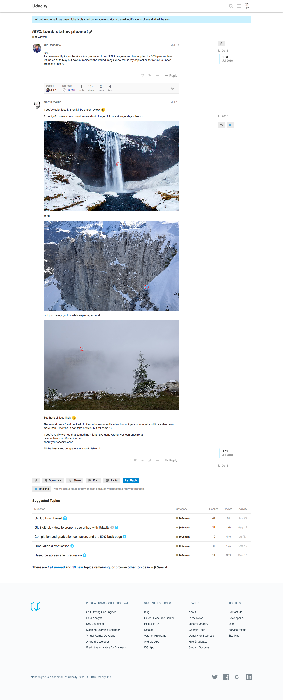

# Save Udacity Forum Posts

## Instructions

* [Download Python3](https://www.python.org/downloads/)
* Clone this repository and `cd` into the folder
* Create a virtualenv, activate it, and install the necessary packages from `requirements.txt`:

```
$ python3 -m venv env
$ source env/bin/activate
$ pip install -r requirements.txt
```

* If you're _not_ on a Mac, [download the right chromedriver](http://chromedriver.chromium.org/downloads) (as well as [Chrome](https://support.google.com/chrome/answer/95346?co=GENIE.Platform%3DDesktop&hl=en)) for your OS (the Mac chromedriver is included in this repo)
* Open `get_links.py` and enter your paths and credentials, then **run** the script: `python get_links.py`
* Open `get_posts.py` and enter your paths and credentials, then **run** the script: `python get_posts.py`

You will get all your Udacity Discourse forum posts saved as HTML files.

## Why?

Udacity announced that they will be sunsetting their old Discourse Forums at [https://discussions.udacity.com/](https://discussions.udacity.com/).

It is not entirely sure whether this means all posts will go offline,
or if the Forums might remain online as a resource.

If you are like me, you might think you have posted some fun or interesting stuff
up there, and would like to keep a copy of it for yourself and future
reference.

At the bottom of your `username/activity` page, there is a "Download All"
button that fetches all your posts:


However, what you get is **only your own posts, unformatted, and without media**
in CSV format.

This:


Simply looks different than that:



The scripts in this repository allow you to fetch all your posts rendered as
they are on the website frontend, as well as some surrounding posts for context.

---

## TODO: Possible Improvements

### Style

- Create a module, or a `setup.py` file that handles with user input and Auth, so
that the user only needs to input credentials once
- Unify the files, or create a pipeline, so that the user only needs to run one
file

### Functionality

Currently the script is **not fetching full-length threads if they require loading
to get all posts**.

There are some issues related to that, which I worked on a bit but currently
don't feel like doing more about, namely:

- scrolling **unloads** posts - i.e. when you scroll from top to bottom and then
save the webpage, the earlier posts go blank again
- I haven't identified the API resource that the post JSON is loaded from, but
fetching the resource directly might be a good way to go

If you want to work on this, here are two useful links:
* [https://www.diggernaut.com/blog/how-to-scrape-pages-infinite-scroll-extracting-data-from-instagram/](https://www.diggernaut.com/blog/how-to-scrape-pages-infinite-scroll-extracting-data-from-instagram/)
* [https://stackoverflow.com/questions/34764815/scraping-site-that-uses-ajax/34802775#34802775](https://stackoverflow.com/questions/34764815/scraping-site-that-uses-ajax/34802775#34802775)

Also: **Improving the file naming** so that there are no potential overwrites
and subsequent data loss. This is not necessary if the above (full-thread scrape)
gets properly implemented.

---

Pull requests happily accepted, and for now I hope this can be useful for
someone :)
